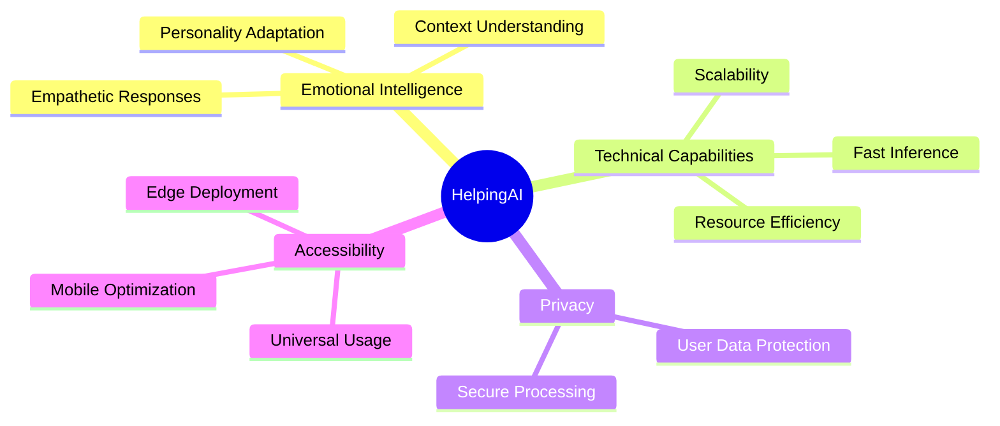

# 🤖 HelpingAI

***Building emotionally intelligent AI for everyone***

---

## 🌟 About HelpingAI

HelpingAI is revolutionizing AI interaction through open-source, emotionally intelligent conversational models. Our mission is to create accessible, human-like AI assistants that understand and engage with genuine empathy.

### ✨ Core Principles

- 🧠 **Emotional Intelligence**: Advanced understanding of emotional context and nuanced responses
- 🛡️ **Privacy-First**: Committed to user privacy and data protection
- 📱 **Universal Access**: Optimized for various devices and use cases
- 🔧 **Open Development**: Community-driven improvements and customization

---

## 🚀 Our Models

### Current Models

| Model | Description | EI Score |
|-------|-------------|-----------|
| `HelpingAI-15B` | Our flagship model combining superior emotional intelligence with advanced technical capabilities | 96.79 |
| `HelpingAI2-9B` | Next-generation model designed for nuanced emotional understanding | 95.89 |
| `HelpingAI-9B` | Specialized in creating deep emotional connections | 89.23 |
| `HelpingAI2-6B` | Perfect balance of performance and emotional intelligence | 93.5 |
| `HelpingAI-Flash` | Lightning-fast 2B parameter model optimized for quick responses | 87.5 |
| `HelpingAI-3B` | Compact yet powerful model for detailed conversations | 88.0 |

## 📅 Roadmap

### Upcoming Releases

- **HelpingAI-2.5** (November 17)
  > Revolutionary memory and personalization capabilities
  - Enhanced context retention
  - Advanced personality adaptation
  - Improved conversation coherence

- **Diwali Re-release** (October)
  > Major updates to existing models
  - HelpingAI 3B with enhanced personality
  - Optimized Flash model series

---

## 🤝 Community & Contribution

### Join Our Community

> *"Great things are never done by one person. They're done by a team of people."*

We believe in the power of community collaboration. Here's how you can get involved:

- 💡 **Share Ideas**: Propose new features or improvements
- 🐛 **Report Issues**: Help us identify and fix problems
- 🔧 **Contribute Code**: Submit pull requests and help develop new features
- 📚 **Documentation**: Help improve our documentation and examples

### Development Discussion

Join our active discussions:
- [GitHub Discussions](https://github.com/HelpingAI/community/discussions)
- Community contact: **Abhay Koul** (HelpingAI)

---

## 🎯 Model Focus Areas

---

## 📊 Model Comparison

| Feature | Flash | 3B | 6B | 9B | 15B |
|---------|-------|-------|-------|-------|-------|
| Speed | ⚡⚡⚡ | ⚡⚡ | ⚡⚡ | ⚡ | ⭐ |
| Memory | ⭐ | ⭐⭐ | ⭐⭐⭐ | ⭐⭐⭐⭐ | ⭐⭐⭐⭐⭐ |
| EI Level | ⭐⭐ | ⭐⭐⭐ | ⭐⭐⭐⭐ | ⭐⭐⭐⭐ | ⭐⭐⭐⭐⭐ |
| Mobile Ready | ✅ | ✅ | ⚠️ | ❌ | ❌ |

---

### 🌟 Support HelpingAI

If you find our work valuable, please consider:

⭐ Starring our repositories

🔄 Sharing our models

👥 Contributing to development

*Together, we're building the future of emotionally intelligent AI*

---

*Built with ❤️ by the HelpingAI Community*

